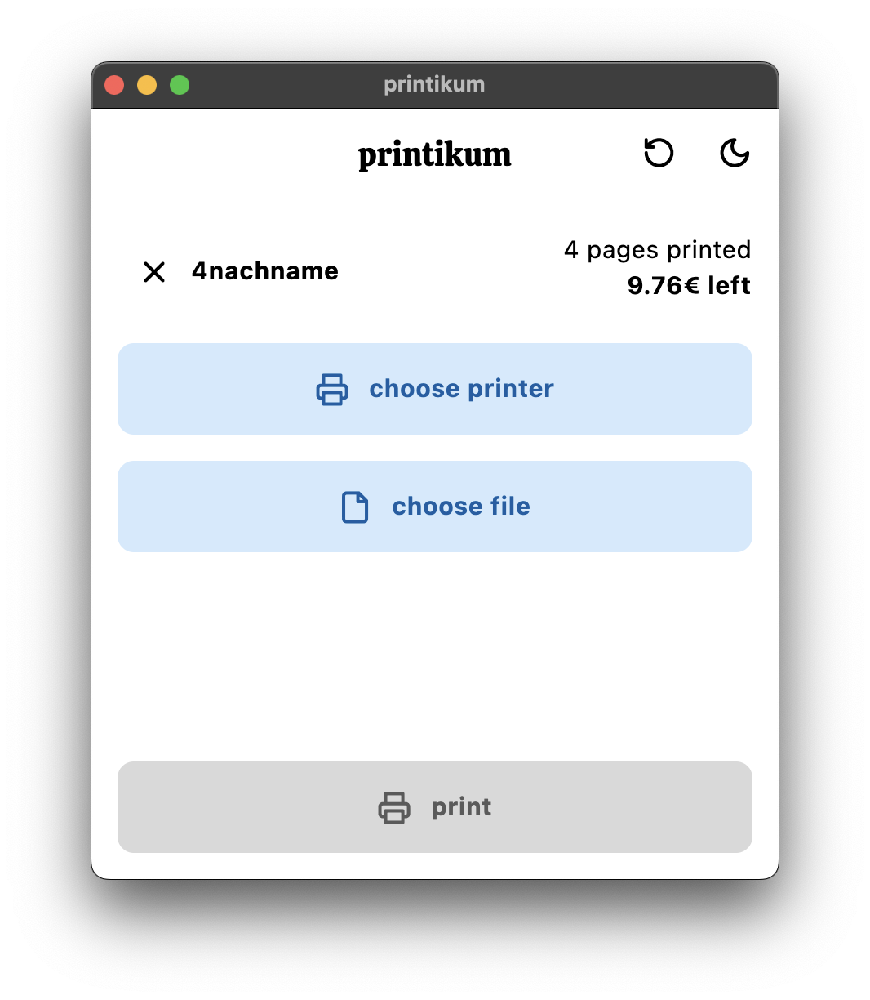
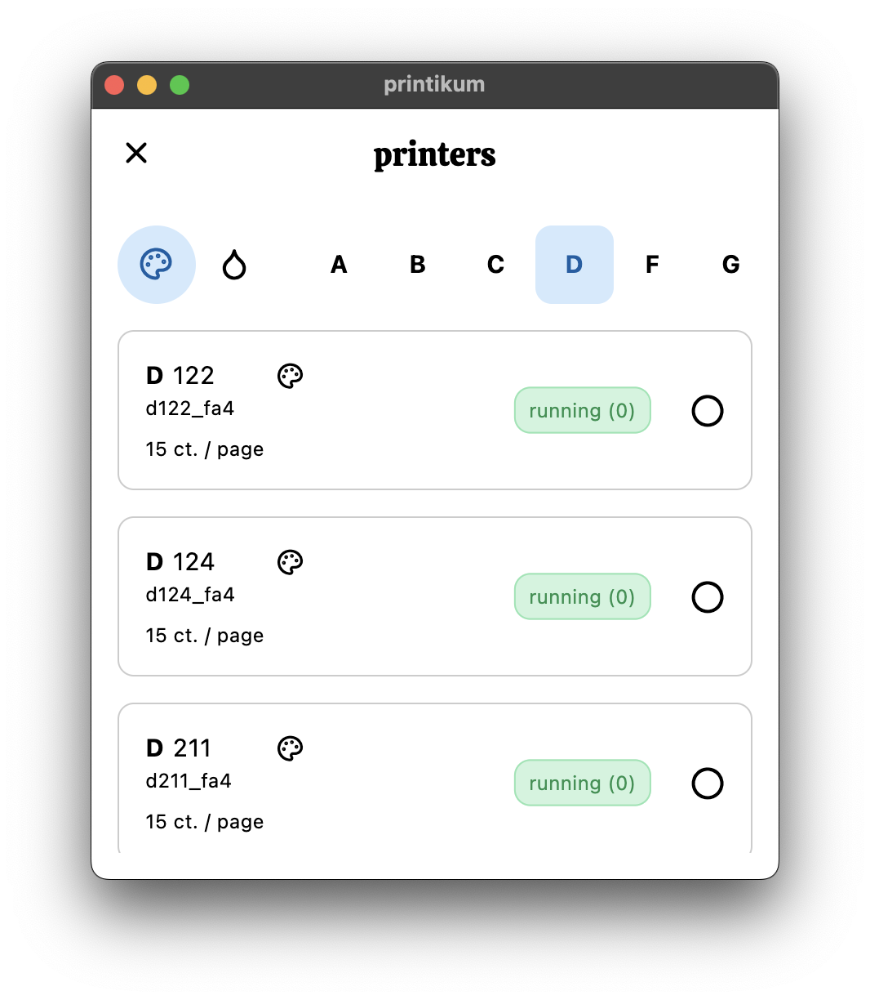
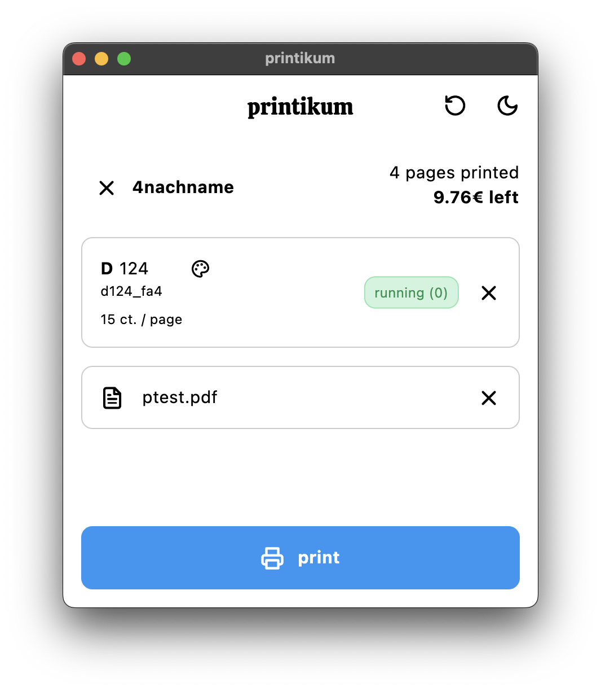
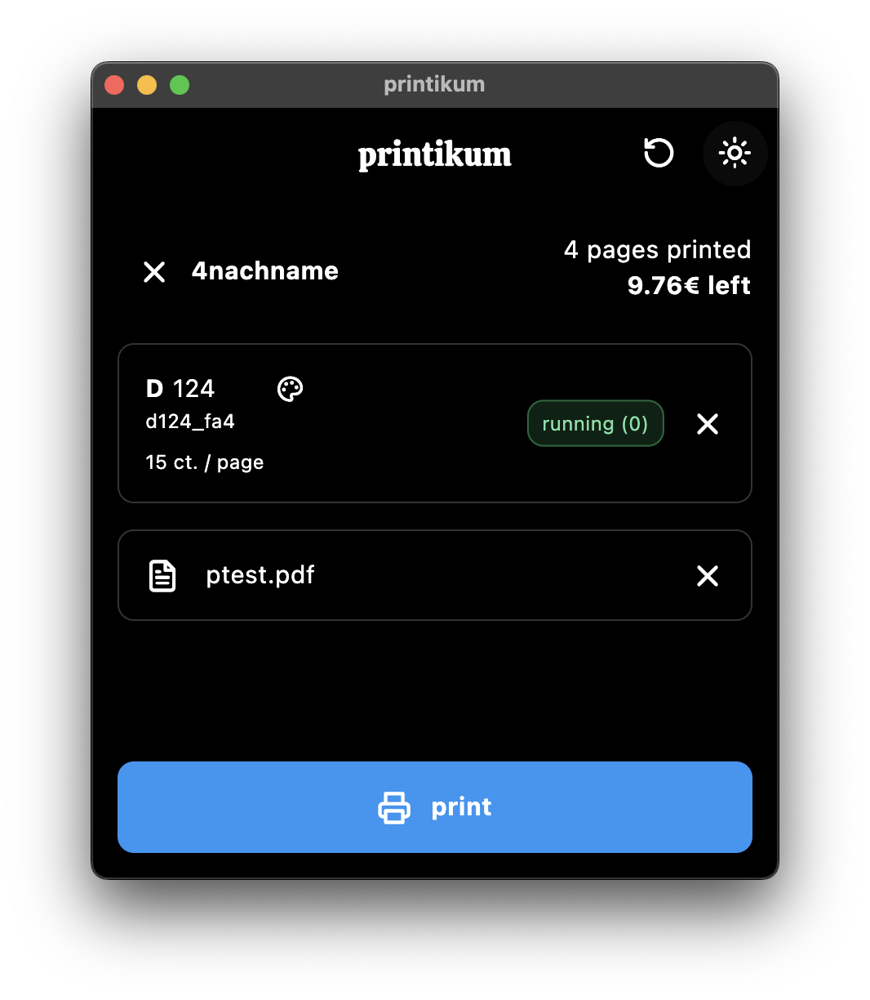

# printikum

a simple utility for printing at the ikum in Hamburg

## Features
- User-friendly interface for easy document selection and printing
- Support for various file formats, including PDF, and images
- view your current quota balance
- works from any network

## Screenshots

## Installation
- download the app for your platform [here](https://apps.robbb.in/printikum) 

#### building
- **macOS**
    1. `flutter build macos`
    2. `open macos/Runner.xcworkspace`
    3. set signing to `development`
    4. select `Product` > `Archive`

## Contributing
Contributions are welcome! If you'd like to contribute to printikum (or have an idea), just send me a message

## License
This project is licensed under the [MIT License](LICENSE).

## Contact
For any inquiries or support, please send me a message or an email
Yours, Robin