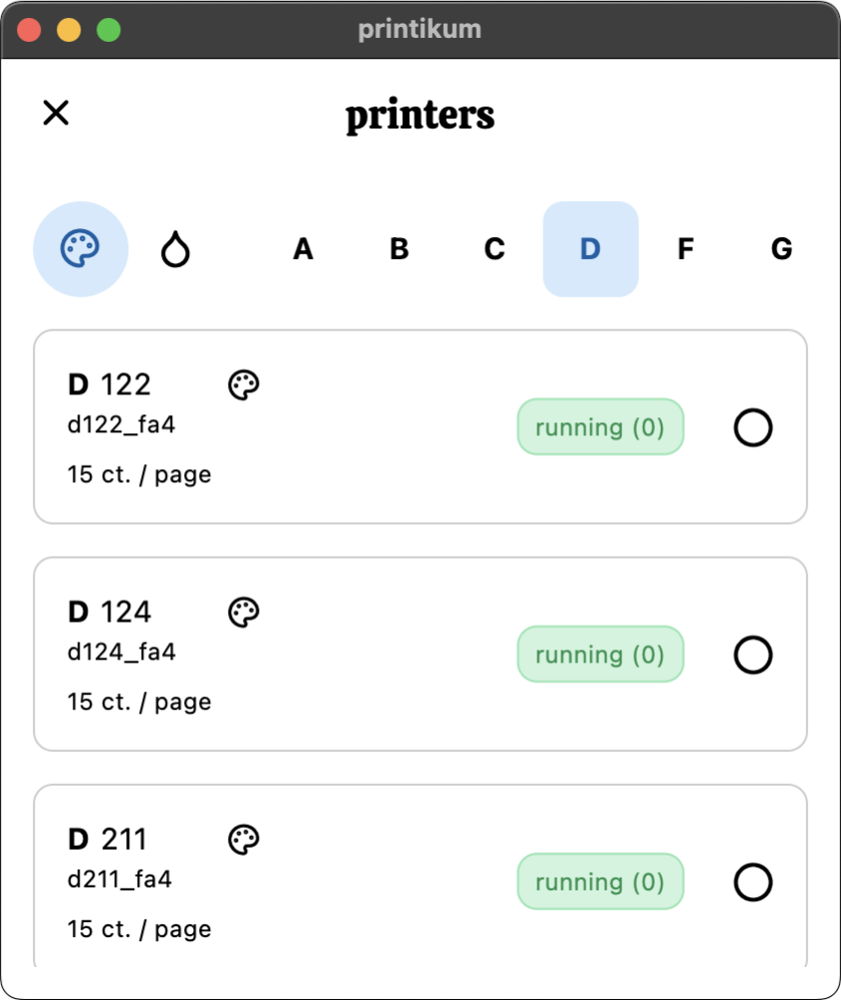

# printikum __

a simple, cross platform utility for printing at the Informatikum at the University of Hamburg

You can learn more about it on my personal website [here](https://apps.robbb.in/printikum).

### Features

- User-friendly interface for easy document selection and printing
- Support for various file formats, including PDF, and images
- view your current quota balance
- works from any network

### Screenshots

__&nbsp;&nbsp;
__

### Install

The App is available for: Android, macOS, Windows, Linux

- download it **[here](https://apps.robbb.in/printikum)**

### Contribute

Contributions are welcome! If you'd like to contribute to printikum (or have an idea), just send me a message

### License

This project is licensed under the [MIT License](LICENSE).

### Contact

For any inquiries or support, please send me a message or an email

I wish you a great day 
Yours, Robin
